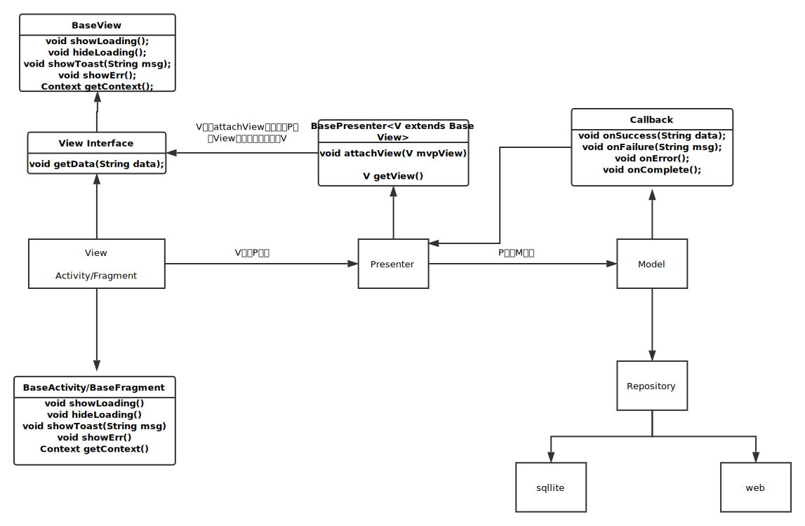

## 包含内容

#### 2 MVP  

#### 2 基于CoordinatorLayout的页面布局

 2.1 布局代码结构
 
  参考[activity_main.xml](app/src/main/res/layout/activity_main.xml)
 
 <DrawerLayout>
 
    <CoordinatorLayout>
    
        <!-- 工具栏 -->
        <AppBarLayout>
            
            <CollapsingToolbarLayout>
            
                <ImageView> </ImageView>
                
                <ToolBar> </ToolBar>
            
            </CollapsingToolbarlayout>
        
            <TabLayout> </TabLayout>
        
        </AppBarLayout> 
        
        <!-- 内容区-->
        <ViewPager  app:layout_behavior="@string/appbar_scrolling_view_behavior"> 
        
        </ViewPager>
        
        <!--底部工具栏-->
        <BottomNavigationView></BottomNavigationView>
        
        <!-- 浮动工具栏 -->
        <FloatingActionButton> </FloatingActionBar>
    
    </CoordinatorLayout>

    <!--抽屉菜单-->
    <NavigationView></NavigationView>
    
 </DrawerLayout>
  
 2.2 组件
 
 2.2.1 CoordinatorLayout
 
    Coordinatorlayout 继承ViewGroup 实现NestedScrollingParent接口，主要功能是作为顶级布局，协调内部实现NestedScrollingChild接口的直接子布局之间动作。
      
    例如：和AppBarlayout、CollapsingToolbarLayout实现一个具有视差动画的可伸缩头部title。
          和FloatingActionButton实现当SnakeBar出现时，上移浮动按钮。
          
 2.2.2 Behavior          

    Behavior 是CoordinatorLayout 和其子view之间的桥梁。常用的“app:layout_behavior="@string/appbar_scrolling_view_behavior”。也可以自定义behavior，主要实现两个方法：layoutDependsOn(parent,child,dependency)和onDependentViewChange(parent,child,dependency):
        
    @Override
    public boolean layoutDependsOn(CoordinatorLayout parent,View child, View dependency){
        return dependency instanceof AppBarlayout；
    }
    
    @Override
    public boolean onDependentViewChanged(CoordinatorLayout parent,View child,View dependency){
        
        float translationY = Math.abs(dependency.getTop());
        child.setTranslationY(translationY);
        return true;
    }
    
 2.2.3 AppBarLayout
    
    AppBarLayout 继承 LinearLayout，布局是垂直方向，当某个ScrollView滚动时，用AppBarLayout生成的顶部栏，可以做出响应的动作，比如保持不动，按某种顺序一起滚动。

 2.2.4 CollapsingToolbarLayout
 
   可折叠的toolbar,通过添加app:layout_scollFlags设置执行不同的动作。
    
   只使用ToolBar时也可以把app:layout_scollFlags设置在ToolBar上。
    
   可设置的值有五个：
        
   scoll :
    
    滚动，如果不设置将固定显示不会滚动。
    注意：1、设置其他值时必须先设置这个值。
        2、如果设置这个值的child view的前面child view没有设置这个值，那这个childview的值也将无效。
        
    app:layout_scrollFlags="scroll"
        
   enterAlways: 
    
    优先滚动设置这个值的child view，再滚动Scolling View。刚好和scoll相反。
        
    app:layout_scrollFlags="scroll|enterAlways"
        
   enterAlwaysCollapsed:
     
    和enterAlways配合使用。 给child view 设置高度（layout_height）和最小高度(minHeight)，向下滚动，滚动步骤是：先把设置这个值的child view滚动到最小高度，然后滚动Scolling view,到达底部边界时，再继续滚动child view到设置的高度。
        
    app:layout_scrollFlags="scroll|enterAlways|enterAlwaysCollapsed"
        
   exitUtilCollapsed:
     
    给child view 设置高度（layout_height）和最小高度(minHeight)，向上滚动，滚动的步骤是：先把设置这个值的child view滚动到最小高度，然后滚动Scolling view，到达顶部边界。 child view 会一直显示。
        
    app:layout_scrollFlags="scroll|exitUntilCollapsed"
        
   snap：
     
    设置这个值的child view 要么全部显示，要么全部不显示。当我们滚动到一半时，手指松开，要么向下全部滚进屏幕，有点类似ViewPager的左右滑动。
        
    app:layout_scrollFlags="scroll|snap"
   
  2.2.5 Toolbar
    
    Toolbar 替代 ActionBar，提供更丰富的布局。
    layout_collapseMode : 子布局设置折叠模式：
        pin  ：固定模式，在折叠的时候最后固定在顶端
        parallax ： 视差模式，在折叠的时候会有个视差折叠的效果。

  2.2.6 TabLayout
  
     置于ViewPager上方，和ViewPager实现联动。
     
     mTabLayout.setupWithViewPager(mViewPager);
     
     tip:在执行mTabLayout.setupWithViewPager(mViewPager);之后，会清除在xml文件<TabLayout>标签中添加的所有<tab>。解决办法就是在ViewPager的FragmentPagerAdapter中的，getPageTitle(int position)方法重新设置标签。例如：
     @Override
     public CharSequence getPageTitle(int position) {
         return titles[position];
     }
     
  2.2.7 ViewPager
  
    配合Fragment，实现多个Fragment切换.通过添加 app:layout_behavior="@string/appbar_scrolling_view_behavior"和AppBarLayout实现联动。

  2.2.8 FloatingActionButton
    
    浮动框，点击之后通过Snackbar弹出提示消息，自身随之向上移动。

  2.2.9 BottomNavigationView
  
    底部菜单
  
  2.3.0 NavigationView

    抽屉菜单
